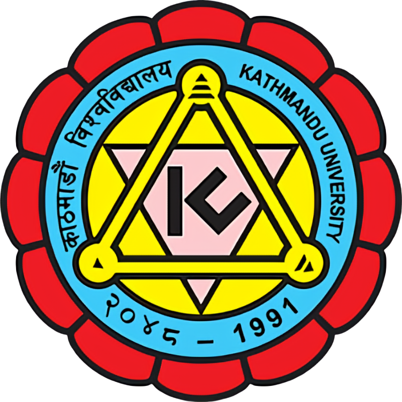

Currently, I am actively seeking for Ph.D. opportunities. 
### Bachelor in Electrical Engineering (2018 - 2023) 

  
Kathmandu University, Nepal 

* GPA 3.64/4.0
* Major Courses : Power System, Power Electronics,Electric Machines, Control System and Engineering, Renewable Energy, Smart Grid, Engineering Projects and C/C++
