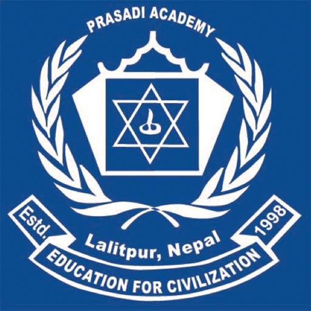
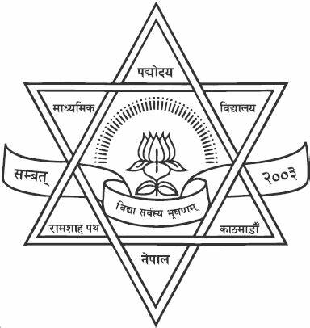

## Education Background  

### Bachelor in Electrical and Electronics Engineering (2018 - 2023)  

  
  Kathmandu University, Nepal

* GPA 3.64/4.0
* Percentage Equivalent : 87.05%
* Major Courses : Power System, Power Electronics, Electric Machines, Control System and Engineering, Renewable Energy, Smart Grid, Engineering Projects and C/C++
 

### High Level School ( 10 +2), Science (2015 - 2017) 

  
  Prasadi Academy, Nepal

* Percentage 79.5 %

### School Leaving Certificate (SLC)  

  
  Padmodaya Public Model Secondary School, Nepal 

* Percentage 80.5 %
 
