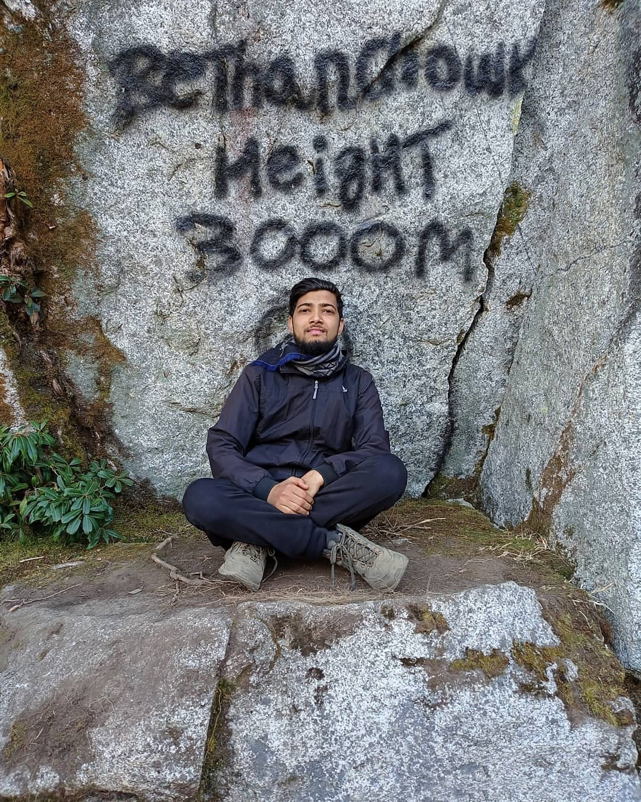
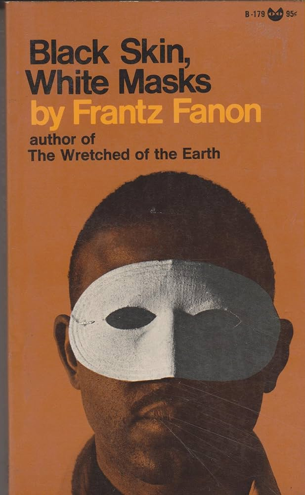

collection: personal life
permalink: /life/
---

When I’m not working, you’ll find me exploring nature through hiking and adventure, capturing moments with my camera, or diving into a good book. These things keep me inspired and balanced, blending creativity, curiosity, and a love for discovery.

<h1>Hiking Clips</h1>

  <!-- Image 1 -->
  

    
  

  <!-- Image 2 -->
  

    
   

  <!-- Image 3 -->
  

    
  

  <!-- Image 4 -->
  

    
  

   

 The listed books have deeply influenced me in terms of my work, discipline, and helped to build an amazing perspective on the world and humanity.
<h1> Some Book Recommendation</h1>

  <!-- Book 1 -->
  

    
  

  <!-- Book 2 -->
  

    
  

  <!-- Book 3 -->
  

    
  

  <!-- Book 4 -->
  

    
    
 This book is about why Western Side Europe have made significant progressed than Eastern Europe. 

  

