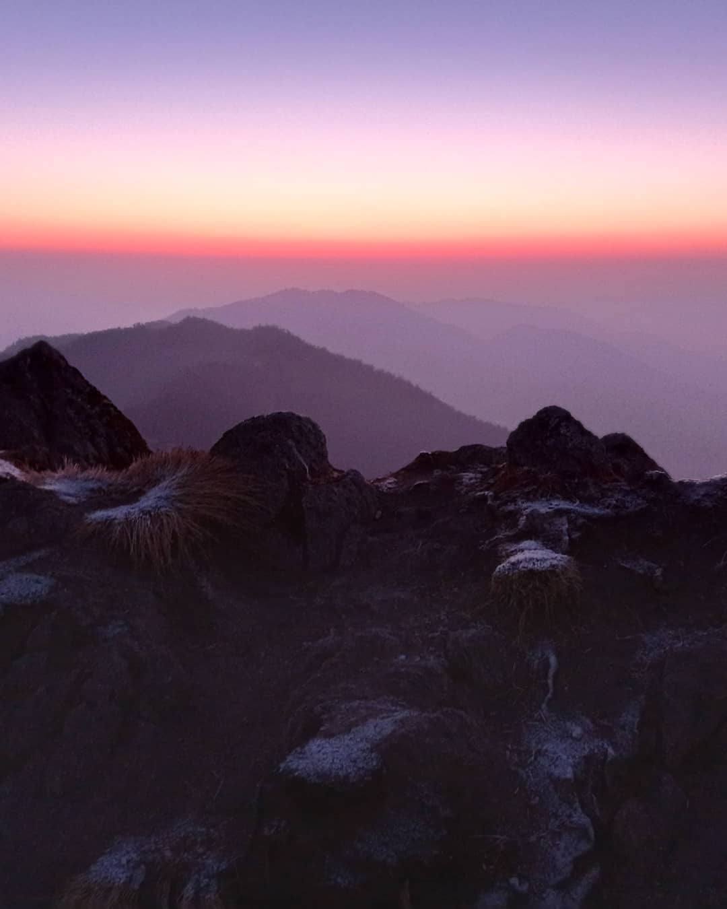

When I’m not working, you’ll find me exploring nature through hiking and adventure, capturing moments with my camera, or diving into a good book. These things keep me inspired and balanced, blending creativity, curiosity, and a love for discovery.

<h1>My Hiking Clips</h1>

  <!-- Replace these image links with your own -->
  
  
  
  

<style>
  .image-grid {
    display: grid;
    grid-template-columns: repeat(auto-fit, minmax(200px, 1fr)); /* Responsive columns */
    gap: 15px; /* Spacing between images */
    padding: 10px;
  }

  .image-grid img {
    width: 100%; /* Ensure images fill their container */
    height: auto;
    border-radius: 10px; /* Rounded corners for a modern look */
    box-shadow: 0 4px 8px rgba(0, 0, 0, 0.2); /* Add some shadow for depth */
    transition: transform 0.3s ease, box-shadow 0.3s ease; /* Hover animation */
  }

  .image-grid img:hover {
    transform: scale(1.05); /* Slight zoom on hover */
    box-shadow: 0 8px 16px rgba(0, 0, 0, 0.3); /* Enhanced shadow on hover */
  }  
  
These books have profoundly influenced me in terms of my work, discipline, and offered new perspectives on the world and humanity.
<table>
  <tr>
    <td>
      
      <h3>Power Electronics Project (Undergraduate Thesis)</h3>
      
Developed a leakage current mitigation strategy using its topology for Solar Energy Integration in Grid.

    </td>
    <td>
      
      <h3>PLMD - IoT (Undergrad 7th Semester Project)</h3>
      
Developed an IoT-based house energy monitoring device for demand-side response.

    </td>
  </tr>
  <tr>
    <td>
      
      <h3>UNET</h3>
      
Implemented the UNET model from scratch for image segmentation tasks in Python.

    </td>
    <td>
      
      <h3>Neural Style Transfer</h3>
      
Replicated the neural style transfer technique to apply artistic styles to images.

    </td>
  </tr>
</table>

