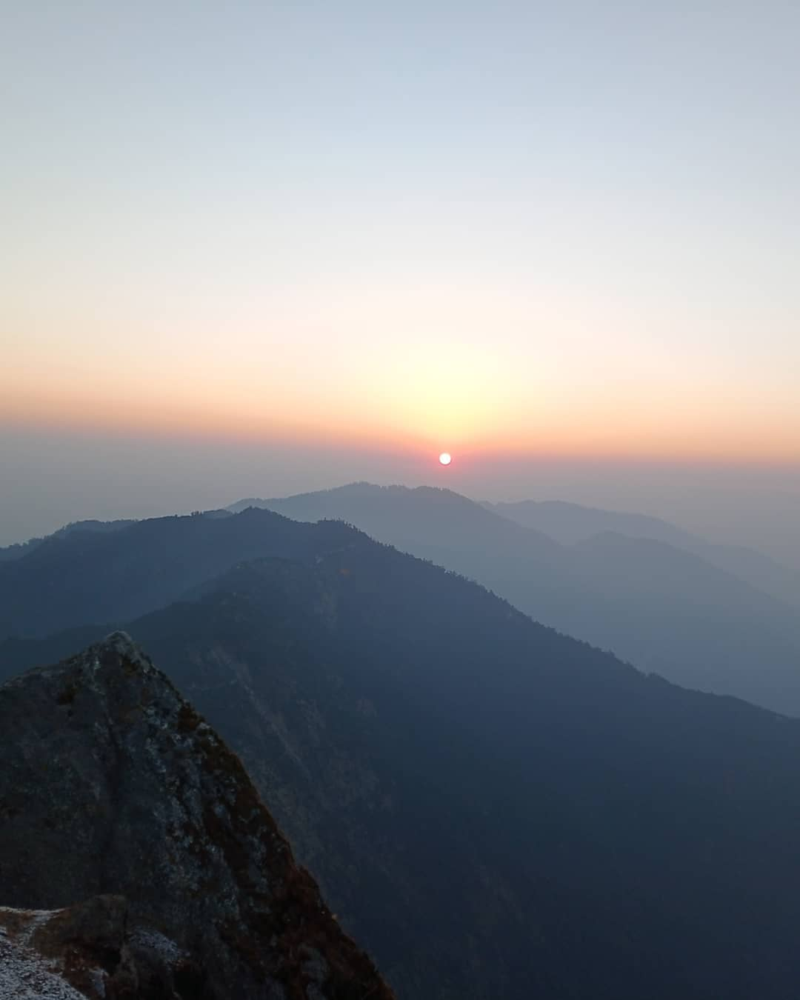

When I’m not working, you’ll find me exploring nature through hiking and adventure, capturing moments with my camera, or diving into a good book. These things keep me inspired and balanced, blending creativity, curiosity, and a love for discovery.

<h1>My Projects</h1>

  <!-- Project 1 -->
  

    
    

      <h3>PowerElectronics Project (Undergraduate Thesis)</h3>
      
Developed a leakage current mitigation strategy using T6 topology for Solar Energy Integration in Grid.

    

  

  <!-- Project 2 -->
  

    
    

      <h3>PLMD - IoT (Undergrad 7th Semester Project)</h3>
      
Developed an IoT-based house energy monitoring device for demand-side response.

    

  

  <!-- Project 3 -->
  

    
    

      <h3>UNET</h3>
      
Implemented the UNET model from scratch for image segmentation tasks in Python.

    

  

  <!-- Project 4 -->
  

    
    

      <h3>Neural Style Transfer</h3>
      
Replicated the neural style transfer technique to apply artistic styles to images.

    

  

<h1>My Hiking Clips</h1>

  

    
    
Narayanthan Hiking Trail

  

  

    
    
Serenity in Nature

  

  

    
    
Exploring Hidden Trails

  

  

    
    
The Sikles Experience

  

